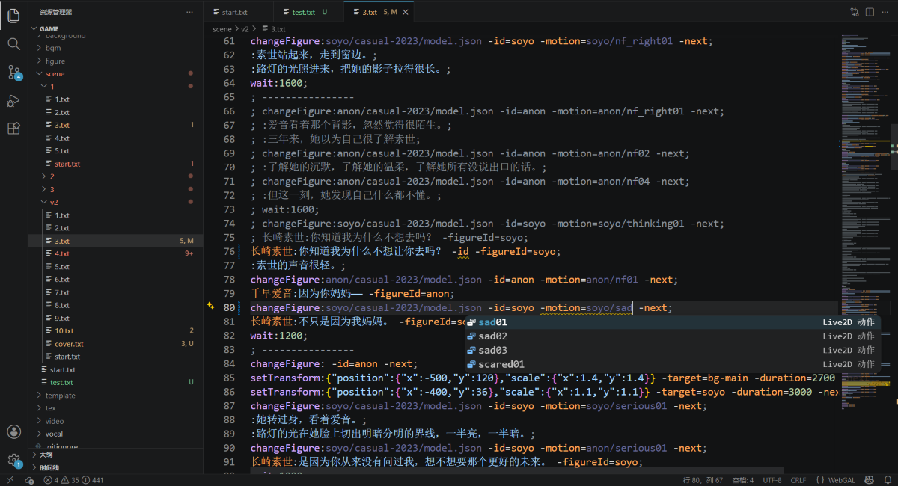

# WebGAL LSP

WebGAL 语言基础设施。

> :construction: 项目仍在开发中，欢迎试用和反馈。

## :sparkles: 功能

- **语言解析**：提供 WebGAL 语法解析与数据结构支持
- **自动补全**：语句、参数、资源路径、标识符等智能提示 -> [详细说明](./docs/complete.md)
- **代码诊断**：语法错误、资源缺失等实时检查 -> [详细说明](./docs/diagnose.md)
- **语义高亮**：语句类型、参数、注释等色彩渲染

#### 功能展示



## :rocket: 快速开始

> [!IMPORTANT]
> 此服务器在标准 LSP 的基础上进行了扩展（详见文档注释），第三方客户端需要提供支持。

### :gear: 语言服务器

#### 编译
```bash
cargo build -p webgal-ls
```

#### 启动模式
语言服务器支持两种通信模式，根据客户端类型选择：

- **:computer: stdio 模式（默认）**  
  适用于 VS Code 等桌面客户端。
  ```bash
  cargo run -p webgal-ls
  ```

- **:globe_with_meridians: WebSocket 模式**  
  适用于浏览器环境（如 Monaco）。
  ```bash
  cargo run -p webgal-ls -- --ws 8765
  ```
  服务器将监听 `ws://127.0.0.1:8765`，接受一个 WebSocket 连接。

---

### :package: VS Code 扩展

扩展源码位于 `packages/vscode-extension`。

1. 安装依赖：
   ```bash
   cd packages/vscode-extension
   npm install
   ```
2. 在 VS Code 中打开该目录，按 `F5` 启动调试窗口。  
   （扩展将自动编译 TS / Rust 前后端并启动语言服务器。）

## :page_facing_up: 许可证

Code: MPL-2.0, 2026, fltLi
