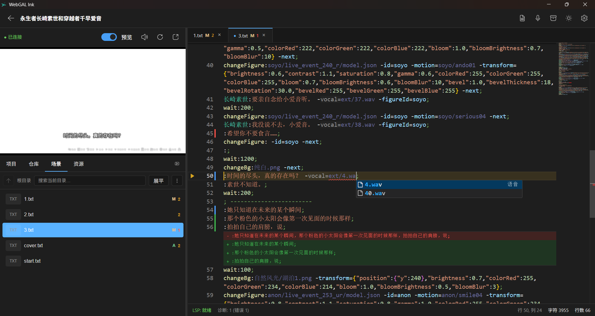

# WebGAL LSP

WebGAL 语言基础设施。

> :construction: 项目仍在开发中，欢迎试用和反馈。

## :sparkles: 功能

- **语言解析**：提供 WebGAL 语法解析与数据结构支持
- **自动补全**：语句、参数、资源路径、标识符等智能提示 -> [详细说明](./docs/complete.md)
- **静态检查**：语法、资源依赖、格式规范等实时检查 -> [详细说明](./docs/diagnose.md)
- **动态诊断**[^1]：通过后台模拟脚本执行，检测逻辑问题 -> [详细说明](./docs/diagnose.md#逻辑分析)
- **语义高亮**：语句类型、参数、注释等色彩渲染
- **悬浮文档**：悬停查看语句、参数的详细说明 -> [详细说明](#documentation-license)
- **代码编辑**：提供轻量级编辑器，集成上述语言服务 -> [详细说明](#webgal-ink-编辑器)

[^1]: 实验性功能，后续将逐步完善和稳定。

#### 功能展示



## :rocket: 快速开始

> [!IMPORTANT]
>
> 此服务器在标准 LSP 的基础上进行了扩展（详见文档注释），第三方客户端需要提供支持。

### :gear: 语言服务器

#### 编译

```bash
cargo build -p webgal-language-server
```

#### 启动模式

语言服务器支持两种通信模式，根据客户端类型选择：

- **:computer: stdio 模式（默认）**  
  适用于 VS Code 等桌面客户端。
  ```bash
  cargo run -p webgal-language-server
  ```

- **:globe_with_meridians: WebSocket 模式**  
  适用于浏览器环境（如 Monaco）。
  ```bash
  cargo run -p webgal-language-server -- --port 8765
  ```
  服务器将监听 `ws://127.0.0.1:8765`，接受一个 WebSocket 连接。

#### 服务器配置

日志输出到 `stderr`，所有参数均为可选：

- **日志**：`--log-level <LEVEL>`（`error`/`warn`/`info`/`debug`/`trace`，默认 `error`），`--log-format <FORMAT>`（`plain`/`text`/`json`，默认 `plain`）
- **功能开关**：`--disable-{diagnose,hover,highlight,complete,format}` 可分别禁用对应能力（默认全部开启）
- **诊断调优**：`--diagnostic-delay <MS>`（批处理延迟，默认 500ms），`--diagnostic-timeout <MS>`（生成超时，默认 10000ms）

示例：
```bash
cargo run -p webgal-language-server -- --log-level debug --disable-hover --disable-complete --diagnostic-delay 300
```

---

### :pencil2: WebGAL Ink 编辑器

> 基于 Tauri 2 + React + Monaco + Fluent UI 的 WebGAL 桌面场景编辑器，内置上述语言服务与实时预览，开箱即用。

1. 安装依赖：
   ```bash
   npm install
   ```

2. 启动开发模式：
   ```bash
   cd editor
   npm run tauri dev
   ```

编辑器特性：

- 多标签场景编辑、自动保存、最近项目；
- **内置 LSP**：语义高亮、自动补全、诊断、格式化、悬浮文档等；
- **实时预览**、资源浏览、深浅色主题与编辑器设置。

---

### :package: VS Code 扩展

扩展源码位于 `packages/vscode-extension`。

1. 安装依赖：
   ```bash
   cd packages/vscode-extension
   npm install
   ```

2. 在 VS Code 中打开项目根目录，按 `F5` 并选择 **`Launch VSCode Extension`** 调试配置以编译服务器并启动扩展开发窗口。

---

### :test_tube: 基础解析 Playground

> WebGAL 解析器的在线演示工具，支持实时解析和语义高亮。

- **在线预览**：[https://fltli.github.io/webgal-lsp](https://fltli.github.io/webgal-lsp)
- **本地运行**：在 VS Code 中打开项目根目录，按 `F5` 并选择 **`Launch Parse Playground`** 调试配置以编译运行并打开网页。

## :page_facing_up: 许可证

- **Code**: MPL-2.0, 2026, fltLi
- <a id="documentation-license">**Built-in documentation**</a>: MPL-2.0, derived from [OpenWebGAL/WebGAL_Doc](https://github.com/OpenWebGAL/WebGAL_Doc), located at `crates/webgal-language-service/data/document.json`
